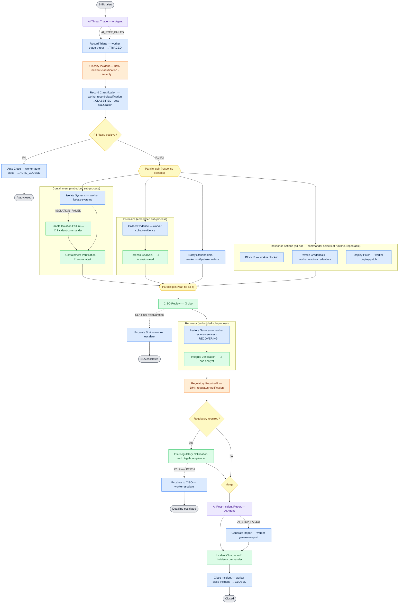

# UC4 One-Page Cheat-Sheet (glance during the walkthrough)

Colour = element type · 👤 = human task (Tasklist) with its candidate group · dashed = error / timer escalation.

## Legend
| Colour | Meaning |
|---|---|
| 🟦 Blue | Spring Boot **job worker** (automated service task) |
| 🟧 Orange | **DMN** business rule task (decision) |
| 🟪 Purple | **AI Agent** connector step |
| 🟩 Green | **Human task** in Tasklist (👤 + candidate group) |
| 🟨 Yellow diamond/hex | **Gateway** (exclusive / parallel) |
| ⬜ Grey | Start / End event |
| ┄ Dashed | **Error boundary** or **non-interrupting timer** escalation |

## The 30-second narration
**SIEM alert → AI triage → DMN classify (P1–P4; P4 auto-closes) → parallel [Containment · Forensics ·
Notify · ad-hoc actions] → CISO review (SLA timer) → Recovery → DMN regulatory (72h timer) → AI report
→ commander closes.** Automated steps are workers; decisions are DMN; reasoning is AI; people act in
Tasklist; deadlines are timers.

## Numbers to say
**13** workers · **2** DMN (both FIRST) · **2** AI Agent steps · **1** ad-hoc sub-process · **3**
embedded sub-processes · **7** Tasklist forms · **5** personas · **2** BPMN errors · **2** escalation timers.

## Status machine (persisted in `incidents.status`)
`RAISED → TRIAGED → CLASSIFIED → RECOVERING → CLOSED`  ·  early exit `→ AUTO_CLOSED` (P4).
SLA by severity: **P1 PT4H · P2 PT8H · P3 PT24H**. Regulatory deadline: **PT72H**.

## Personas → candidate groups
SOC Analyst `soc-analyst` · Incident Commander `incident-commander` · Forensics Lead `forensics-lead`
· CISO `ciso` · Legal/Compliance `legal-compliance`.

## Three exception paths to show
- **Isolation fails** (`forceIsolationFailure:true`) → BPMN error → **Handle Isolation Failure** (commander).
- **False positive** (`attackConfirmed:false`) → DMN **P4** → **auto-close**, no human tasks.
- **72h deadline** on the regulatory task → non-interrupting timer → **Escalate to CISO** (task stays open).

## One-liner answers (if asked "why")
Embedded sub-process = no reuse + shared vars + one deployable · Ad-hoc = runtime, repeatable selection
· DMN FIRST = single deterministic output over an ordered precedence list · AI + fallback = never stalls
· BPMN error vs incident = expected-deviation-to-human vs technical-retry-to-Operate · Non-interrupting
timer = escalate in parallel without cancelling the task · Idempotent = `businessKey` + guard.
